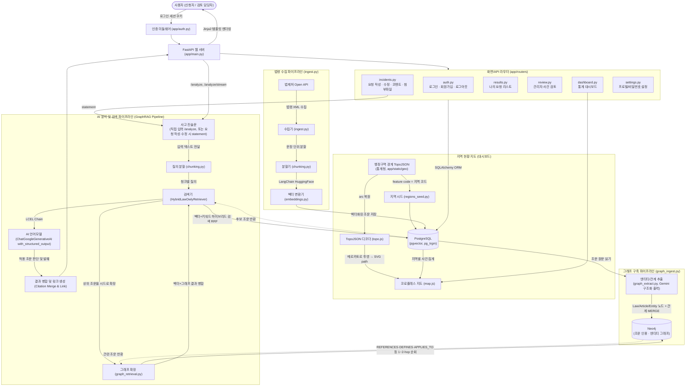
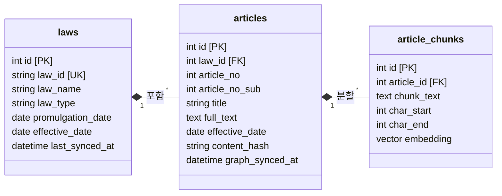
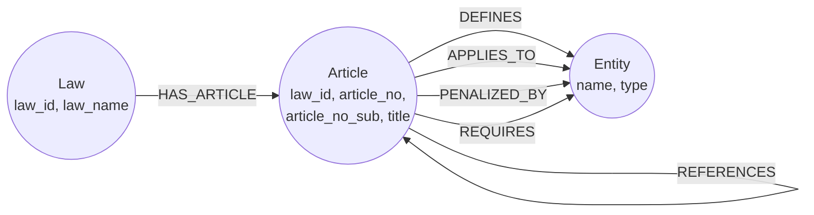
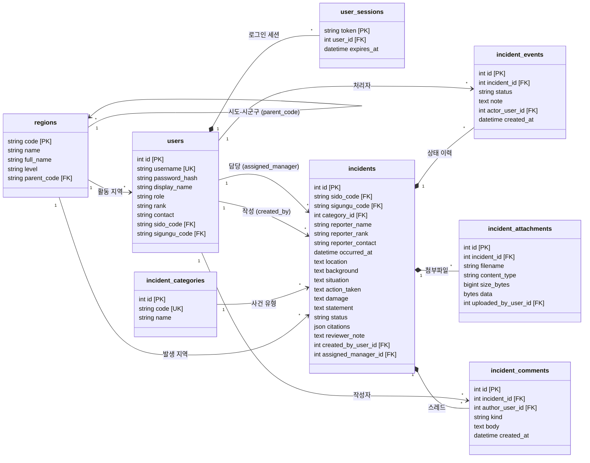

# Law Owly (법 부엉이)

사고 상황을 서술한 긴 텍스트를 입력하면, 관련 법령 중 실제로 적용되는 조문을 찾아
원문 위치에 하이라이트하고 법제처 원문 링크를 함께 보여주는 서비스.

단순 조문 검색 도구를 넘어, **전국 단위 사건사고 접수·검토 워크플로우**와 **지역별 발생 현황
지도**를 갖춘 애플리케이션으로 확장되어 있다. 사건은 전국 시·도(17개)·시·군·구(250개) 단위로
접수되며, 대시보드의 코로플레스 지도에서 어느 지역에 어떤 유형의 사건이 몰려 있는지 한눈에 볼 수
있다. 로그인/회원가입, 역할 기반 접근 제어(신청자/검토 담당자), 사건 상태 이력 추적, 첨부파일을
포함한다.

법령은 산업안전 계열뿐 아니라 민법·형법·상법·민사소송법·형사소송법 등 주요 기본법과 교통·환경·
재난 분야 법률까지 다룬다([app/ingest.py](app/ingest.py)의 `TARGET_LAWS`).

## 아키텍처



### 💡 초보자를 위한 아키텍처 상세 설명

이 프로젝트는 마치 도서관에서 책을 미리 분류해 두고, 나중에 질문을 받으면 가장 알맞은 책을 찾아주는 것처럼,
그리고 그 위에 "민원 접수창구(사건 관리)"를 얹은 구조로 동작합니다. 크게 **다섯 부분**(웹 애플리케이션 계층, 데이터 수집, 그래프 구축, AI 분석, 데이터베이스 구조)으로 나뉩니다.

#### 0. 웹 애플리케이션 계층 (인증 + 사건 관리 워크플로우)

- **인증 (`app/auth.py`, `app/routers/auth.py`)**:
  - 비밀번호는 PBKDF2-HMAC-SHA256(솔트 포함)으로 해싱해 저장합니다.
  - 세션은 쿠키에 정보를 담지 않고(JWT 미사용), 추측 불가능한 랜덤 토큰만 쿠키(`sla_session`)에 담아 DB의
    `user_sessions` 테이블과 대조합니다. 로그아웃 시 해당 행을 지우면 즉시 무효화됩니다.
  - 회원가입 시 역할(신청자/검토 담당자), 활동 지역(시·도 → 시·군·구), 직급, 연락처를 등록하며, 담당자 전용
    화면(`/dashboard`, `/review`)은 신청자 계정으로 접근 시 403으로 막힙니다.

- **심층 검토 요청 (`app/routers/incidents.py`, `/request`)**:
  - 신청자가 **사건 발생 지역(시·도/시·군·구)과 사건 유형**, 그리고 사고일시·사고장소·사고경위·당시상황·
    조치내용·피해상황 6개 항목과 증빙 파일(PDF/문서/이미지, 최대 5개·20MB)을 입력해 접수합니다.
    작성자 인적사항은 사칭을 막기 위해 클라이언트 입력을 신뢰하지 않고 로그인 계정의 프로필 값을 씁니다.
    반면 발생 지역은 신고자 소속과 무관하게 전국 어디든 신고할 수 있어야 하므로 폼에서 받되, 서버가
    실재하는 시·군·구인지와 선택된 시·도에 속하는지를 검증합니다.
  - 단, 지역·유형은 분석 원문(`statement`)에는 **넣지 않습니다**. 이 원문이 곧 조문 검색의 질의문이라
    "제주특별자치도" 같은 지명이 섞이면 그 지명이 우연히 등장하는 무관한 조문이 상위로 올라오기 때문입니다.
  - 접수된 항목들은 하나의 `statement` 원문으로 합쳐져 곧바로 RAG 분석 파이프라인에 태워지고, 적용 조문이
    자동으로 하이라이트됩니다. 분석이 실패해도(LLM 장애 등) 신고 자체는 유실되지 않고 인용 없이 접수됩니다.

- **사건 상태 워크플로우**: `검토 요청 → 검토중 → (보완 요청 ↔ 보완 완료) → 검토 완료`의 상태 기계로
  운영되며, 모든 전이는 `incident_events`에 append-only로 감사 이력이 남습니다.
  - 관리자가 코멘트 종류를 **보완 요청**으로 남기면 상태가 `보완 요청`으로 바뀌고, 신청자는 "나의 요청
    리스트"(`/results`)에서 최초 작성했던 폼 틀을 그대로 유지한 채 내용을 보완할 수 있습니다.
  - 신청자가 보완 내용을 제출(`보완 내용 제출`)하면 상태가 자동으로 **보완 완료**로 전환되고, 이 처리
    이력은 "나의 요청 리스트"와 "관리자 검토"(`/review`) 양쪽의 사건 이력 타임라인에 동일하게 표시됩니다.
  - 관리자가 **최종 결과**(결론)를 등록하면 `검토 완료`로 종료되며, 완료된 건에 신청자가 추가 문의를
    남기면 다시 `검토중`으로 재오픈됩니다.
  - 한 사건에 "검토 시작"을 처음 누른 관리자가 담당자로 고정되어, 이후에는 그 담당자만 코멘트/상태 변경이
    가능합니다(중복 처리 방지).

- **담당자 검토 (`/review`) / 전국 대시보드 (`/dashboard`)**: 담당자는 시·도·시·군·구·사건유형·상태·
  키워드로 전체 사건을 검색하고, 각 사건의 처리 이력과 스레드를 확인하며 조문 인용을 직접 추가/제거할 수
  있습니다. 대시보드는 기간별 상태 분포와 **전국 코로플레스 지도**(시·도 → 시·군·구 드릴다운),
  지역 순위, 사건 유형별 분포를 제공합니다.

- **설정 (`/settings`)**: 로그인한 사용자가 표시 이름·직급·연락처·활동 지역·비밀번호를 직접 수정합니다.

#### 1. 데이터 수집 및 저장 (Data Ingestion Pipeline)
우리가 검색할 "법률 책"들을 도서관(DB)에 미리 들이고, 꼼꼼하게 색인(Index)을 달아두는 준비 과정입니다.

- **법제처 Open API (`ingest.py`)**: 
  - **스토리텔링**: 도서관에 최신 법률 서적을 들여오는 과정입니다. 서비스 최초 실행 시 국가(법제처) 시스템에 접속해 `TARGET_LAWS`에 적힌 법령들(민법·형법·산업안전보건법·도로교통법 등)을 싹 가져옵니다.
  - **업데이트 구조**: 법은 매년 바뀌기 마련입니다. 다시 수집 명령을 실행하면 조문 원문의 해시(`content_hash`)를 비교해 **내용이 바뀐 조문만** 다시 쪼개고 임베딩합니다. 수십 개 법령을 반복 수집해도 이미 넣어둔 것은 건너뛰므로, 중간에 멈췄다 이어서 돌리는 것이 안전합니다.
  - **오류 격리**: 법령 하나가 실패해도(API 오류, 이름 불일치) 나머지는 계속 수집하고, 마지막에 실패 목록을 모아 보여줍니다. 또한 법령명이 **정확히 일치**할 때만 수집합니다 — "민법"처럼 짧은 이름은 유사 법령이 수십 개라, 예전처럼 첫 번째 검색 결과를 그냥 쓰면 엉뚱한 법이 들어올 수 있기 때문입니다.

- **문장 분할 (`chunking.py`)**: 
  - **스토리텔링**: 두꺼운 법전 한 권을 통째로 꽂아두면 나중에 원하는 내용을 찾기 힘듭니다. 그래서 책을 한 장씩, 나아가 한 문단씩 쪼개어 보관하는 작업입니다.
  - **현재 방식**: 지금은 글자 수와 문장(마침표 등)을 기준으로 문장이 잘리지 않게 앞뒤가 살짝 겹치도록 자르는 방식(Sliding Window)을 사용하고 있습니다.
  - **향후 개선점**: 앞으로는 법령의 특성을 살려 "제1장 -> 제1조 -> 제1항" 처럼 목차(계층) 구조를 잃지 않고 쪼개거나(Hierarchical Chunking), AI가 문맥이 바뀌는 지점을 스스로 판단해서 자르는(Semantic Chunking) 방식을 도입한다면 검색의 질이 훨씬 더 높아질 것입니다.

- **의미 벡터화 (`embeddings.py`)**: 
  - **스토리텔링**: 쪼개진 글 조각들을 컴퓨터만이 이해할 수 있는 '수학적 좌표(숫자 배열)'로 바꾸는 과정입니다.
  - **모델 배경 (`multilingual-e5-large`)**: 이 프로젝트는 `multilingual-e5-large`라는 오픈소스 AI 모델을 사용합니다. 이 모델은 한국어를 포함한 다국어 텍스트의 "숨은 의미"를 기가 막히게 잘 포착합니다. 굳이 매번 돈을 내고 외부 유료 API(OpenAI 등)를 쓰지 않아도, 로컬 환경에서 무료로 빠르고 정확하게 문장의 문맥 좌표를 계산해 줍니다. 
  - **성능 및 메모리 최적화**: 16GB 등 제한된 RAM 환경에서도 시스템이 뻗지(OOM) 않고 안정적으로 작동하며 GPU를 최대한 활용할 수 있도록 최적화되어 있습니다. GPU가 감지되면 모델 가중치를 절반 크기(FP16)로 압축해서 로드하고, 데이터를 넘기는 묶음(Batch size)을 16으로 줄여 메모리 폭주를 사전에 차단합니다. 덕분에 메모리 부담 없이 매우 빠른 속도로 문맥 좌표가 계산됩니다.

- **데이터베이스 (`PostgreSQL + pgvector`)**: 
  - **스토리텔링**: 좌표가 부여된 글 조각들을 잘 정리된 서랍에 넣고, 요청이 오면 번개처럼 찾아내는 과정입니다. 
  - **조회 구조**: 나중에 사용자가 "공사장에서 작업하다 떨어졌어"라고 요청(Query)을 보내면, DB는 다음 두 가지 서랍을 동시에 뒤집니다. 첫 번째 서랍에서는 **'공사장', '떨어짐' 같은 정확한 단어(키워드, pg_trgm)**가 들어간 문장을 찾고, 두 번째 서랍에서는 **'높은 곳에서 바닥으로 추락하는 의미(벡터 좌표, pgvector)'**가 가장 가까운 조문들을 찾습니다. 그런 다음 이 두 검색 결과를 똑똑하게 융합(RRF 기법)하여 가장 완벽한 법 조문 랭킹 리스트를 AI에게 전달하게 됩니다.

#### 2. 그래프 구축 (Knowledge Graph Pipeline)
벡터 임베딩만으로는 "이 조문이 어떤 다른 조문을 인용하는지", "이 조문 위반 시 어떤 처벌 조항으로 이어지는지" 같은 **조문 간 관계**를 알 수 없습니다. 그래서 조문 원문을 한 번 더 AI에게 읽혀 관계를 뽑아내고, 이를 그래프 데이터베이스에 저장해둡니다.

- **엔티티/관계 추출 (`graph_extract.py`)**: `annotate.py`와 같은 LangChain 구조화 출력(`with_structured_output`) 방식으로, 조문 원문에서 (1) 명시적으로 인용하는 다른 조문 번호(`references`)와 (2) 조문에 등장하는 핵심 개념(의무주체·적용대상·처벌·요구사항)과 그 관계 유형(`DEFINES`/`APPLIES_TO`/`PENALIZED_BY`/`REQUIRES`)을 뽑아냅니다.
- **그래프 적재 (`graph_ingest.py`)**: Postgres의 `laws`/`articles`를 순회하며 추출 결과를 Neo4j에 `MERGE`합니다. 벡터 임베딩 파이프라인(`ingest.py`)과는 완전히 분리된 별도 명령(`python -m app.graph_ingest`)이라, 몇 번을 다시 실행해도 기존 pgvector 데이터에는 영향이 없습니다.
- **왜 Neo4j인가**: "이 조문과 1~2단계 이내로 연결된 조문 전부"처럼 관계를 타고 넘나드는 질의는 관계형 테이블의 JOIN보다 그래프 순회(traversal)로 표현하는 편이 자연스럽고 빠릅니다.

#### 3. AI 분석 및 검색 (GraphRAG Pipeline)
사용자가 사고 내용을 입력했을 때, 저장된 법령 중 가장 정확한 조문을 찾아 매칭해주는 실제 서비스 과정입니다. 단독 조문 조회 화면(`/analyze`)뿐 아니라, 심층 검토 요청을 새로 작성하거나(`POST /api/incidents`) 보완 수정할 때(`POST /api/incidents/{id}/edit`)도 동일한 파이프라인이 재사용됩니다.
- **질의 텍스트 전달**: 사용자가 입력한 긴 사고 진술문을 여러 개의 짧은 문장으로 나눕니다.
- **하이브리드 검색 (`HybridLawOwlyRetriever`, `app/retrieval.py`)**: 사용자의 문장들을 데이터베이스에 던져 검색합니다. 이때 단순히 **같은 단어(키워드)**가 있는지 찾는 방식과, **문맥의 의미(벡터)**가 비슷한지 찾는 두 가지 방식을 섞어서(하이브리드) 가장 관련성 높은 법 조문 후보들을 1차로 싹쓸이해옵니다.
- **그래프 확장 (`graph_retrieval.py`)**: 위에서 찾은 상위 조문 몇 개를 "시드"로 삼아 Neo4j에서 `REFERENCES`(명시적 인용)나 같은 엔티티를 공유하는 조문을 1~2-hop 이내에서 찾아 후보 목록에 추가합니다. 벡터·키워드 검색이 놓칠 수 있는, 문구는 다르지만 법적으로 연결된 조문을 보강하는 역할입니다. 그래프 확장 결과는 항상 벡터·키워드 검색 결과보다 낮은 우선순위로 덧붙여지며, Neo4j가 응답하지 않아도 예외를 삼키고 기존 결과만으로 정상 동작합니다.
- **AI 최종 판단 (`ChatGoogleGenerativeAI`)**: 찾아온 후보 법 조문들과 사용자의 사고 진술문을 최신 인공지능인 **Gemini API**에게 넘겨줍니다. *"이 사고 상황에 이 법 조문들이 실제로 적용되는 게 맞는지 확인해줘"*라고 지시(프롬프트)하여, AI가 엄격하게 진짜로 적용되는 조문만 선별하고 인용 근거를 작성합니다.
- **결과 화면**: 최종적으로 선별된 법 조문과 링크를 사용자가 보기 편하도록 화면의 원문 위치에 색깔별로 하이라이트(형광펜) 칠해서 보여줍니다. 관리자 검토 화면에서는 문구를 드래그해 구간만 재분석하거나 마커를 클릭해 조문을 제거하는 등 결과를 직접 편집할 수도 있습니다.

#### 4. 데이터베이스 ER 다이어그램 (ERD)

#### 4-1. 법령 검색 도메인 (법제처 데이터 + 임베딩)



**테이블 세부 설명:**
- `laws` (법령): 산업안전보건법 등 큰 단위의 법률 정보를 저장합니다. (`law_id`: 법령 고유 ID)
- `articles` (조문): 법령에 속한 실제 조문의 원문 전체(`full_text`)와 제목(`title`)을 보관합니다. 
- `article_chunks` (조문 조각): 긴 조문을 검색하기 좋게 문장 단위로 짧게 쪼개어 놓은 테이블입니다. 원문의 위치(`char_start`, `char_end`)를 기록해두고, AI가 이해할 수 있는 1024차원의 수학적 좌표(`embedding`)를 저장하여 유사도 검색에 활용합니다.

#### 4-2. 지식 그래프 도메인 (Neo4j, `graph_ingest.py`로 적재)

Postgres의 `laws`/`articles`와 동일한 조문을 가리키지만(law_id·article_no·article_no_sub로 매핑), 관계형 테이블이 아니라 노드-관계 그래프로 저장되어 "조문 간 연결"을 직접 순회할 수 있습니다.



**노드/관계 설명:**
- `Law` / `Article` 노드: Postgres의 `laws`/`articles`를 그래프로 미러링한 노드입니다. `HAS_ARTICLE`로 법령과 조문을 연결합니다.
- `Article -[REFERENCES]-> Article`: 조문 원문에 "제38조에 따라"처럼 다른 조를 명시적으로 인용하는 경우 생성됩니다(같은 법령 내 인용을 우선 대상으로 합니다).
- `Entity` 노드: 조문에 등장하는 의무주체·적용대상·처벌·요구사항 등 핵심 개념을 `name`+`type`으로 저장합니다. 여러 조문이 같은 엔티티를 가리키면 자연스럽게 "이 개념을 공유하는 다른 조문들"이 그래프상에서 연결됩니다.
- `DEFINES` / `APPLIES_TO` / `PENALIZED_BY` / `REQUIRES`: 조문과 엔티티 사이의 관계 유형입니다(`graph_extract.py`의 `ENTITY_RELATIONS`에 화이트리스트로 정의되어 있습니다).
- 검색 시(`graph_retrieval.py`)에는 벡터+키워드 검색으로 찾은 상위 조문을 시드로, 이 그래프에서 1~2-hop 이내의 `Article` 노드를 추가로 찾아 후보에 보강합니다.

#### 4-3. 사건 관리 워크플로우 도메인 (지역 + 사용자 + 사건)

`regions`는 시도와 시군구를 한 테이블에 담는 **자기참조 구조**다. 시군구 코드("11010")의 앞
2자리가 곧 소속 시도 코드("11")이므로 `parent_code`를 코드에서 바로 도출할 수 있고, 지도의
드릴다운도 같은 규칙 하나로 처리된다.



**테이블 세부 설명:**
- `regions`: 전국 행정구역(시도 17 + 시군구 250). 지도 경계 파일에서 시드되므로 지도 도형의 feature code와 항상 일치합니다(`app/regions_seed.py`).
- `incident_categories`: 사건 유형(산업재해/교통사고/화재·폭발/건설사고/환경오염/의료사고/소비자피해/노동분쟁/기타).
- `users`: 계정 정보. `role`이 `requester`(신청자)면 자신이 올린 요청만, `manager`(검토 담당자)면 전체 사건을 볼 수 있습니다. 지역은 '활동 지역'으로, 사건의 발생 지역과는 별개입니다.
- `user_sessions`: 서버 측 세션 저장소. 쿠키에는 토큰만 담고 실제 유효성은 이 테이블과 대조합니다.
- `incidents`: 심층 검토 요청 1건 = 1행. 발생 지역(`sido_code`/`sigungu_code`)과 유형(`category_id`)은 신고자 소속과 무관하게 폼에서 직접 받습니다. 작성 시 입력한 6개 항목(`occurred_at`~`damage`)과, 이를 합쳐 만든 분석 원문 `statement`, 자동/수동으로 편집되는 `citations`(적용 조문 JSON), 현재 상태 `status`를 가집니다. `created_by_user_id`(작성자)와 `assigned_manager_id`(담당 관리자)를 함께 추적합니다.
- `incident_events`: 상태 변경 감사 이력(append-only). "나의 요청 리스트"와 "관리자 검토" 화면의 사건 이력 타임라인이 이 테이블을 근거로 렌더링됩니다.
- `incident_comments`: 요청자 ↔ 안전부서 간 스레드. `kind`에 따라 보완 요청/보완 내용/추가 문의/최종 결과가 구분되며, 등록 시 `incidents.status`와 `incident_events`가 함께 갱신됩니다.
- `incident_attachments`: 증빙 파일. 별도 오브젝트 스토리지 없이 파일 바이트를 DB에 직접 저장합니다.

## 화면/라우트 요약

| 경로 | 접근 권한 | 설명 |
| --- | --- | --- |
| `/login`, `/signup` | 비로그인 | 로그인 / 회원가입 |
| `/` | 로그인 | 단발성 사고 진술문 조문 분석 (`/analyze`, `/analyze/stream`) |
| `/request` | 로그인 | 심층 검토 요청 작성 |
| `/results` | 로그인 | 나의 요청 리스트 — 상태 확인, 보완 요청 시 원본 틀 유지한 채 내용 수정, 보완 내용 제출, 처리 이력 확인 |
| `/review` | 담당자 | 전체 사건 검토 — 지역·유형·상태·키워드 필터, 코멘트·보완요청·최종결과 등록, 조문 마커 편집, 처리 이력 |
| `/dashboard` | 담당자 | 기간별 상태 통계, **전국 코로플레스 지도**(시·도 → 시·군·구 드릴다운), 지역 순위, 사건 유형별 분포 |
| `/settings` | 로그인 | 프로필/비밀번호 변경 |

## 준비물

1. Docker / Docker Compose
2. **NVIDIA GPU 및 최신 그래픽 드라이버** (선택이지만, 수많은 조문을 임베딩하는 과정의 속도 향상을 위해 강력히 권장됩니다. Docker에서 GPU를 자동으로 사용하도록 설정되어 있습니다.)
3. 법제처 Open API OC 키: https://open.law.go.kr 에서 회원가입 후 발급
4. Gemini API 키: https://aistudio.google.com/apikey (그래프 추출·인용 판정 모두 이 키를 사용하며, 무료 티어는 분당/일일 호출 횟수 제한이 있습니다)

## 설정

```bash
cp .env.example .env
# .env에 LAW_OC_KEY, GEMINI_API_KEY 채워넣기
# Neo4j 접속 정보(NEO4J_URI/NEO4J_USER/NEO4J_PASSWORD)는 기본값 그대로 써도 되고, 필요하면 변경
```

## 실행

아래 명령어들은 Docker를 이용해 우리 시스템을 격리된 환경에서 안전하게 띄우는 과정입니다. 

```bash
# 1. (기존 컨테이너가 있다면) 깔끔하게 내리기
docker compose down

# 2. 파이썬 API 서버 구동에 필요한 패키지나 환경을 미리 빌드(준비)합니다.
# (이때 docker-compose.yml에 설정된 NVIDIA GPU 가속 기능이 자동으로 연결됩니다.)
docker compose build api

# 3. 백그라운드에서 데이터베이스(PostgreSQL) + 그래프 DB(Neo4j) 컨테이너를 실행합니다.
# (-d 옵션은 백그라운드 실행을 의미하므로 터미널을 계속 쓸 수 있습니다.)
docker compose up -d db neo4j

# 4. 법령 데이터 수집 및 임베딩 실행 
# (🔥 여기서 최적화된 GPU 모드가 켜지며 프로그레스 바와 함께 빠르게 진행됩니다!)
docker compose run --rm api python -m app.ingest

# 5. 조문 간 관계/엔티티를 추출해 지식 그래프(Neo4j) 구축
# (조문 1개당 Gemini 1회를 호출합니다. 무료 티어는 분당 15회·일일 500회라 조문이 많으면
#  며칠에 나눠 돌려야 합니다. 처리한 조문에 표시를 남기므로 다시 실행하면 남은 것부터 이어서
#  진행합니다 — 중간에 멈춰도 처음부터 다시 하지 않습니다.)
docker compose run --rm api python -m app.graph_ingest

# 오늘 쓸 수 있는 만큼만 돌리고 싶다면:
docker compose run --rm api python -m app.graph_ingest --limit 400

# 특정 법령만 다시 수집하려면 이름을 인자로 넘깁니다:
docker compose run --rm api python -m app.ingest 도로교통법 민법

# 6. 작업 완료 후 웹 서버(FastAPI) 켜기
docker compose up api
```

http://localhost:8000 접속 시 자동으로 `/login`으로 이동한다. 서버 기동 시(`app/main.py`의 startup 훅) 테이블 생성·마이그레이션(`app/migrate.py`)과 함께 아래 데모 계정이 자동으로 시딩된다(`app/seed.py`, 이미 존재하면 건너뜀). 회원가입 화면에서 직접 계정을 만들어도 된다.

| 아이디 | 비밀번호 | 역할 | 소속 |
| --- | --- | --- | --- |
| `user01` | `1111` | 신청자 | 포항사업장 · 품질보증부 |
| `user02` | `1111` | 신청자 | 포항사업장 · 물류부 |
| `user03` | `1111` | 신청자 | 광양사업장 · 품질보증부 |
| `user04` | `1111` | 신청자 | 구미사업장 · 설비보전부 |
| `manager01` | `1111` | 안전부서 관리자 | 포항사업장 · 안전환경부 |
| `manager02` | `1111` | 안전부서 관리자 | 세종사업장 · 안전환경부 |

로그인 후 신청자 계정은 `/request`에서 심층 검토를 요청하고 `/results`에서 진행 상태를 확인·보완할 수 있으며, 관리자 계정은 `/review`·`/dashboard`에서 전체 사건을 검토·집계할 수 있다.

## 테스트

```bash
pip install -r requirements.txt
pip install pytest
pytest
```

청킹 오프셋 계산과 법제처 링크 생성 로직에 대한 유닛 테스트가 포함되어 있다.
`ingest`/`annotate` 파이프라인은 실제 OC 키·Gemini 키가 있어야 end-to-end 검증이 가능하다.

## 알아둘 점

- 행정구역 목록(`regions`)은 지도 경계 파일에서 시드된다(`app/regions_seed.py`). 지역 목록을 따로 하드코딩하지 않는 이유는, DB의 지역 코드와 지도 도형의 feature code가 어긋나면 색칠할 지역을 못 찾아 지도가 조용히 비어 보이기 때문이다.
- 지도는 외부 라이브러리 없이 직접 그린다. `app/static/topo.js`가 TopoJSON(양자화 + delta 인코딩 + 공유 arc)을 풀고, `app/static/map.js`가 메르카토르로 투영해 SVG path를 만든다. 같은 경계 데이터가 GeoJSON으로는 26MB인데 TopoJSON으로는 770KB라 이 선택을 했다.
  - 투영 시 위도에 `180/π`를 곱해 경도와 축척을 맞추는 부분이 중요하다. 빼먹으면 세로가 50배 눌려 지도가 납작한 선이 된다.
- 사건의 발생 지역·유형은 분석 원문(`incidents.statement`)에 넣지 않는다. 그 원문이 곧 조문 검색 질의문이라 지명이 섞이면 무관한 조문이 상위로 올라온다.
- 법제처 딥링크 URL 패턴(`app/law_links.py`)은 사이트 구조가 바뀌면 이 파일만 수정하면 된다.
- 조문 청킹/질의 텍스트 청킹은 모두 `app/chunking.py`의 문장 단위 슬라이딩 윈도우를 공유한다.
- 하이브리드 검색은 `app/retrieval.py`에서 벡터 유사도와 트라이그램 유사도를 RRF로 결합하고, 그 결과를 시드로 `app/graph_retrieval.py`가 Neo4j 그래프 확장을 추가한다. 그래프 확장은 항상 벡터/키워드 결과보다 낮은 우선순위이며, Neo4j 장애 시에도 예외를 삼키고 기존 결과만으로 정상 동작한다.
- 그래프 구축(`app/graph_extract.py`, `app/graph_ingest.py`)은 벡터 임베딩 파이프라인(`app/ingest.py`)과 완전히 분리된 별도 명령이다. 조문 원문에서 참조 관계와 엔티티를 Gemini로 추출해 Neo4j에 `MERGE`하며, 여러 번 재실행해도 안전하다.
- 인증은 JWT 등 외부 라이브러리 없이 `app/auth.py`의 PBKDF2 해싱 + DB 세션 테이블만으로 구현되어 있다.
- 사건 상태 전이는 `app/routers/incidents.py`의 `add_comment()`(코멘트 종류에 따른 자동 전이)와 `update_incident_status()`(관리자 수동 전이) 두 경로에서만 일어나며, 두 경로 모두 반드시 `incident_events`에 이력을 남긴다.
- 신고 원문(`incidents.statement`)은 조문 인용의 문자 오프셋(`citations[].start/end`) 기준이 되므로, 수정(`/api/incidents/{id}/edit`) 시에도 항목을 다시 조합해 `statement`를 새로 만들고 재분석하는 방식으로만 갱신한다.

## 데이터 출처 및 라이선스

- **법령 원문**: 법제처 국가법령정보 공동활용 Open API (https://open.law.go.kr)
- **행정구역 경계**: 통계청(KOSTAT) 2018 행정구역 경계 — [southkorea/southkorea-maps](https://github.com/southkorea/southkorea-maps) 배포본을 `app/static/geo/`에 포함. **KOGL(공공누리)** 라이선스에 따라 출처를 표시한다.
