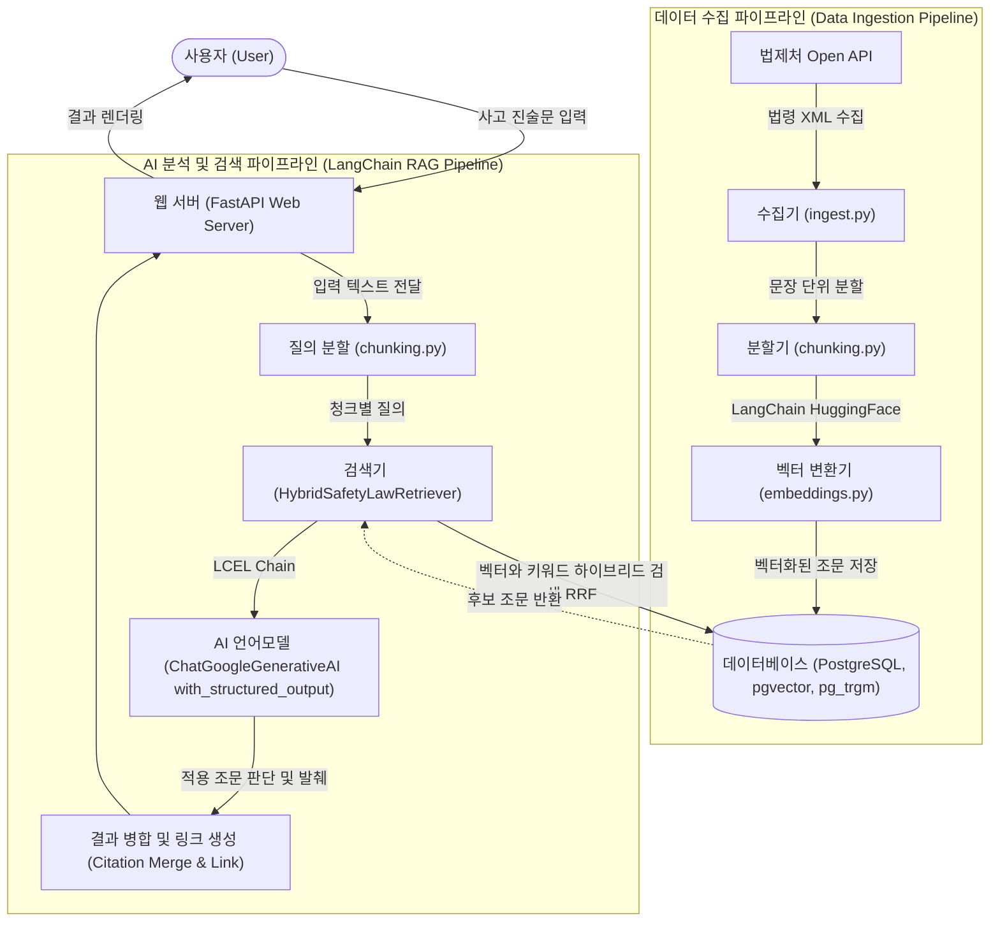

# SafetyLawAdvisor

사고 상황을 서술한 긴 텍스트를 입력하면, 산업안전보건 관련 법령 중 실제로 적용되는 조문을 찾아
원문 위치에 하이라이트하고 법제처 원문 링크를 함께 보여주는 서비스.

## 아키텍처



### 💡 초보자를 위한 아키텍처 상세 설명

이 프로젝트는 마치 도서관에서 책을 미리 분류해 두고, 나중에 질문을 받으면 가장 알맞은 책을 찾아주는 것처럼 **두 가지 주요 단계**로 나뉘어 동작합니다.

#### 1. 데이터 수집 및 저장 (Data Ingestion Pipeline)
우리가 검색할 "법률 책"들을 도서관(DB)에 미리 들이고, 꼼꼼하게 색인(Index)을 달아두는 준비 과정입니다.

- **법제처 Open API (`ingest.py`)**: 
  - **스토리텔링**: 도서관에 최신 법률 서적을 들여오는 과정입니다. 서비스 최초 실행 시 국가(법제처) 시스템에 접속해 최신 산업안전보건법 데이터를 싹 가져옵니다. 
  - **업데이트 구조**: 법은 매년 바뀌기 마련입니다. 만약 법령이 개정되었다면 어떻게 할까요? 이 시스템은 수동으로 다시 데이터를 수집하는 명령어를 실행하면, 기존 법령 ID와 조 번호를 비교하여 새롭게 바뀐 조문만 덮어쓰기(Upsert) 방식으로 똑똑하게 업데이트하도록 설계되어 있습니다.

- **문장 분할 (`chunking.py`)**: 
  - **스토리텔링**: 두꺼운 법전 한 권을 통째로 꽂아두면 나중에 원하는 내용을 찾기 힘듭니다. 그래서 책을 한 장씩, 나아가 한 문단씩 쪼개어 보관하는 작업입니다.
  - **현재 방식**: 지금은 글자 수와 문장(마침표 등)을 기준으로 문장이 잘리지 않게 앞뒤가 살짝 겹치도록 자르는 방식(Sliding Window)을 사용하고 있습니다.
  - **향후 개선점**: 앞으로는 법령의 특성을 살려 "제1장 -> 제1조 -> 제1항" 처럼 목차(계층) 구조를 잃지 않고 쪼개거나(Hierarchical Chunking), AI가 문맥이 바뀌는 지점을 스스로 판단해서 자르는(Semantic Chunking) 방식을 도입한다면 검색의 질이 훨씬 더 높아질 것입니다.

- **의미 벡터화 (`embeddings.py`)**: 
  - **스토리텔링**: 쪼개진 글 조각들을 컴퓨터만이 이해할 수 있는 '수학적 좌표(숫자 배열)'로 바꾸는 과정입니다.
  - **모델 배경 (`multilingual-e5-large`)**: 이 프로젝트는 `multilingual-e5-large`라는 오픈소스 AI 모델을 사용합니다. 이 모델은 한국어를 포함한 다국어 텍스트의 "숨은 의미"를 기가 막히게 잘 포착합니다. 굳이 매번 돈을 내고 외부 유료 API(OpenAI 등)를 쓰지 않아도, 로컬 환경에서 무료로 빠르고 정확하게 문장의 문맥 좌표를 계산해 줍니다. 덕분에 "다쳤다"와 "부상을 입었다"가 서로 글자는 달라도 수학적으로는 아주 가까운 의미 좌표에 놓이게 됩니다.

- **데이터베이스 (`PostgreSQL + pgvector`)**: 
  - **스토리텔링**: 좌표가 부여된 글 조각들을 잘 정리된 서랍에 넣고, 요청이 오면 번개처럼 찾아내는 과정입니다. 
  - **조회 구조**: 나중에 사용자가 "공사장에서 작업하다 떨어졌어"라고 요청(Query)을 보내면, DB는 다음 두 가지 서랍을 동시에 뒤집니다. 첫 번째 서랍에서는 **'공사장', '떨어짐' 같은 정확한 단어(키워드, pg_trgm)**가 들어간 문장을 찾고, 두 번째 서랍에서는 **'높은 곳에서 바닥으로 추락하는 의미(벡터 좌표, pgvector)'**가 가장 가까운 조문들을 찾습니다. 그런 다음 이 두 검색 결과를 똑똑하게 융합(RRF 기법)하여 가장 완벽한 법 조문 랭킹 리스트를 AI에게 전달하게 됩니다.

#### 2. AI 분석 및 검색 (LangChain RAG Pipeline)
사용자가 사고 내용을 입력했을 때, 저장된 법령 중 가장 정확한 조문을 찾아 매칭해주는 실제 서비스 과정입니다.
- **질의 텍스트 전달**: 사용자가 입력한 긴 사고 진술문을 여러 개의 짧은 문장으로 나눕니다.
- **하이브리드 검색 (`HybridSafetyLawRetriever`)**: 사용자의 문장들을 데이터베이스에 던져 검색합니다. 이때 단순히 **같은 단어(키워드)**가 있는지 찾는 방식과, **문맥의 의미(벡터)**가 비슷한지 찾는 두 가지 방식을 섞어서(하이브리드) 가장 관련성 높은 법 조문 후보들을 1차로 싹쓸이해옵니다.
- **AI 최종 판단 (`ChatGoogleGenerativeAI`)**: 찾아온 후보 법 조문들과 사용자의 사고 진술문을 최신 인공지능인 **Gemini API**에게 넘겨줍니다. *"이 사고 상황에 이 법 조문들이 실제로 적용되는 게 맞는지 확인해줘"*라고 지시(프롬프트)하여, AI가 엄격하게 진짜로 적용되는 조문만 선별하고 인용 근거를 작성합니다.
- **결과 화면 (FastAPI 웹 서버)**: 최종적으로 선별된 법 조문과 링크를 사용자가 보기 편하도록 화면의 원문 위치에 노란색으로 하이라이트(형광펜) 칠해서 보여줍니다.

#### 3. 데이터베이스 ER 다이어그램 (ERD)
시스템의 핵심이 되는 PostgreSQL 데이터베이스의 테이블 구조입니다.

```mermaid
classDiagram
    direction LR
    
    class laws {
        int id [PK]
        string law_id [UK]
        string law_name
        string law_type
    }
    
    class articles {
        int id [PK]
        int law_id [FK]
        int article_no
        int article_no_sub
        string title
        text full_text
    }
    
    class article_chunks {
        int id [PK]
        int article_id [FK]
        text chunk_text
        int char_start
        int char_end
        vector embedding
    }

    laws "1" --> "*" articles : 1:N 포함
    articles "1" --> "*" article_chunks : 1:N 분할
```

**테이블 세부 설명:**
- `laws` (법령): 산업안전보건법 등 큰 단위의 법률 정보를 저장합니다. (`law_id`: 법령 고유 ID)
- `articles` (조문): 법령에 속한 실제 조문의 원문 전체(`full_text`)와 제목(`title`)을 보관합니다. 
- `article_chunks` (조문 조각): 긴 조문을 검색하기 좋게 문장 단위로 짧게 쪼개어 놓은 테이블입니다. 원문의 위치(`char_start`, `char_end`)를 기록해두고, AI가 이해할 수 있는 1024차원의 수학적 좌표(`embedding`)를 저장하여 유사도 검색에 활용합니다.

## 준비물

1. Docker / Docker Compose
2. **NVIDIA GPU 및 최신 그래픽 드라이버** (선택이지만, 수많은 조문을 임베딩하는 과정의 속도 향상을 위해 강력히 권장됩니다. Docker에서 GPU를 자동으로 사용하도록 설정되어 있습니다.)
3. 법제처 Open API OC 키: https://open.law.go.kr 에서 회원가입 후 발급
4. Gemini API 키: https://aistudio.google.com/apikey

## 설정

```bash
cp .env.example .env
# .env에 LAW_OC_KEY, GEMINI_API_KEY 채워넣기
```

## 실행

아래 명령어들은 Docker를 이용해 우리 시스템을 격리된 환경에서 안전하게 띄우는 과정입니다. 

```bash
# 1. 백그라운드에서 데이터베이스(PostgreSQL) 컨테이너를 실행합니다. 
# (-d 옵션은 백그라운드 실행을 의미하므로 터미널을 계속 쓸 수 있습니다.)
docker compose up -d db

# 2. 파이썬 API 서버 구동에 필요한 패키지나 환경을 미리 빌드(준비)합니다.
# (이때 docker-compose.yml에 설정된 NVIDIA GPU 가속 기능이 자동으로 연결됩니다.)
docker compose build api
```

### 1) 법령 데이터 수집 (최초 1회, OC 키 필요)

```bash
docker compose run --rm api python -m app.ingest
```

`Data/DATA_SOURCE_URL.md`에 정의된 4개 법령(산업안전보건법, 시행령, 시행규칙,
산업안전보건기준에 관한 규칙)을 조문 단위로 수집해 DB에 저장하고 임베딩까지 생성한다.
법령이 개정되면 같은 명령을 다시 실행하면 된다(법령ID+조번호 기준 upsert).

### 2) 웹 서버 실행

```bash
docker compose up api
```

http://localhost:8000 접속 후 사고 진술문을 입력하면 관련 조문이 하이라이트되어 표시된다.

## 테스트

```bash
pip install -r requirements.txt
pip install pytest
pytest
```

청킹 오프셋 계산과 법제처 링크 생성 로직에 대한 유닛 테스트가 포함되어 있다.
`ingest`/`annotate` 파이프라인은 실제 OC 키·Gemini 키가 있어야 end-to-end 검증이 가능하다.

## 알아둘 점

- 법제처 딥링크 URL 패턴(`app/law_links.py`)은 사이트 구조가 바뀌면 이 파일만 수정하면 된다.
- 조문 청킹/질의 텍스트 청킹은 모두 `app/chunking.py`의 문장 단위 슬라이딩 윈도우를 공유한다.
- 하이브리드 검색은 `app/retrieval.py`에서 벡터 유사도와 트라이그램 유사도를 RRF로 결합한다.
