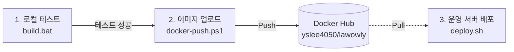
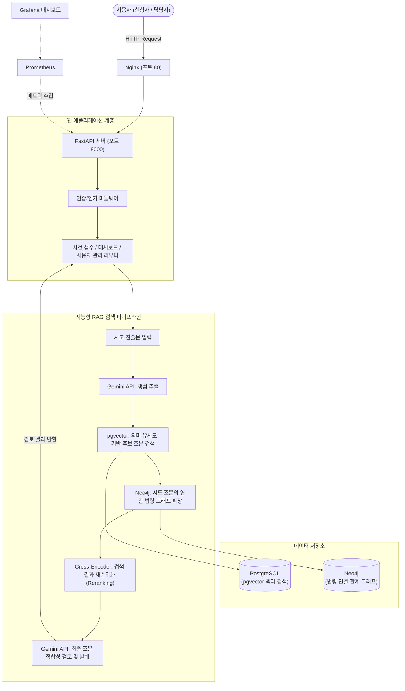
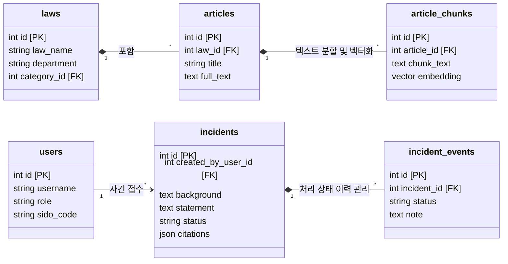

# Law Owly (법 부엉이) - LawGraphRAG

Law Owly는 사용자가 작성한 **사고 진술문(자연어)**을 기반으로, 관련된 **법률 조문을 지식 그래프(Knowledge Graph)와 벡터 검색(RAG)**을 통해 정확하게 찾아주는 스마트 법률 지원 시스템입니다.

단순 검색을 넘어, 전국 단위 사건사고 접수부터 검토까지 처리하는 워크플로우와 지역별 발생 현황을 시각화하는 대시보드 기능이 통합되어 있습니다.

---

## 🚀 빠른 시작 가이드 (초보자용)

### 💡 3단계 배포 워크플로우
이 프로젝트는 Docker 기반으로 동작하여 복잡한 환경 설정 없이 스크립트 하나로 전체 시스템을 띄울 수 있습니다.



### 1️⃣ 소스 코드 다운로드
```bash
git clone https://github.com/hugingstar/LawGraphRAG.git
cd LawGraphRAG
```

### 2️⃣ 시스템 실행 (배포)
Windows 사용자는 `deploy.bat`을 더블클릭하고, Linux/macOS 사용자는 터미널에서 아래 명령어를 실행합니다.
```bash
chmod +x deploy.sh
./deploy.sh
```
- **자동 감지**: 호스트 PC의 NVIDIA GPU 유무를 스스로 판단하여 최적의 이미지(CPU/CUDA)를 실행합니다.
- **방화벽 설정**: `80` 포트가 자동으로 개방되어 외부에서 접속 가능하게 세팅됩니다.
- **모니터링 포함**: 상태 점검을 위한 Grafana, Prometheus 스택이 함께 기동됩니다.

### 3️⃣ 초기 법령 데이터 수집
최초 실행 시 DB가 비어 있으므로, 국가 법령을 다운로드(약 10~20분 소요) 받아야 합니다.
```bash
docker compose exec api python -m app.ingest --all
```

### 4️⃣ 접속
웹 브라우저를 열고 다음 주소로 접속하세요.
- **메인 서비스**: `http://localhost` (서버 IP)
- **운영 대시보드 (Grafana)**: `http://localhost:3001` (서버 내부망에서만 접근 가능)

---

## 🏛️ 시스템 아키텍처 (Architecture)

시스템은 웹 애플리케이션(FastAPI), 데이터 수집 파이프라인, 그래프 추출 AI, 그리고 RAG 검색 엔진으로 촘촘히 연결되어 있습니다.



---

## 🗄️ 데이터베이스 ER 다이어그램 (ERD)

PostgreSQL을 활용해 법령 구조(법, 조문, 조문 분할 조각)를 저장하고, 사용자 및 사건(Incident) 상태를 관리합니다.



---

## 🛠 주요 기능 요약

1. **지능형 조문 분석 (GraphRAG)**: 단순 단어 검색이 아닌, 사용자의 상황을 AI가 이해하고 쟁점을 뽑아낸 뒤 벡터 유사도와 연결 그래프(Neo4j)를 모두 동원하여 정확한 현행 법령을 찾아줍니다.
2. **사건 접수 및 처리 상태 추적**: 전국 단위로 민원을 접수하고, "검토중 -> 보완요청 -> 보완완료 -> 검토완료"의 워크플로우를 통해 체계적으로 관리합니다.
3. **전국 사건 현황 시각화**: 통계청 TopoJSON 데이터를 활용한 코로플레스(Choropleth) 지도를 통해 전국 시/도/구 단위로 어느 지역에 어떤 사건이 집중되는지 한눈에 파악할 수 있습니다.
4. **증분 법령 수집**: 법제처 Open API와 연동하여 법령이 새로 바뀌거나 폐지된 내용만 똑똑하게 부분 업데이트합니다. 비용과 시간을 획기적으로 절약합니다.
