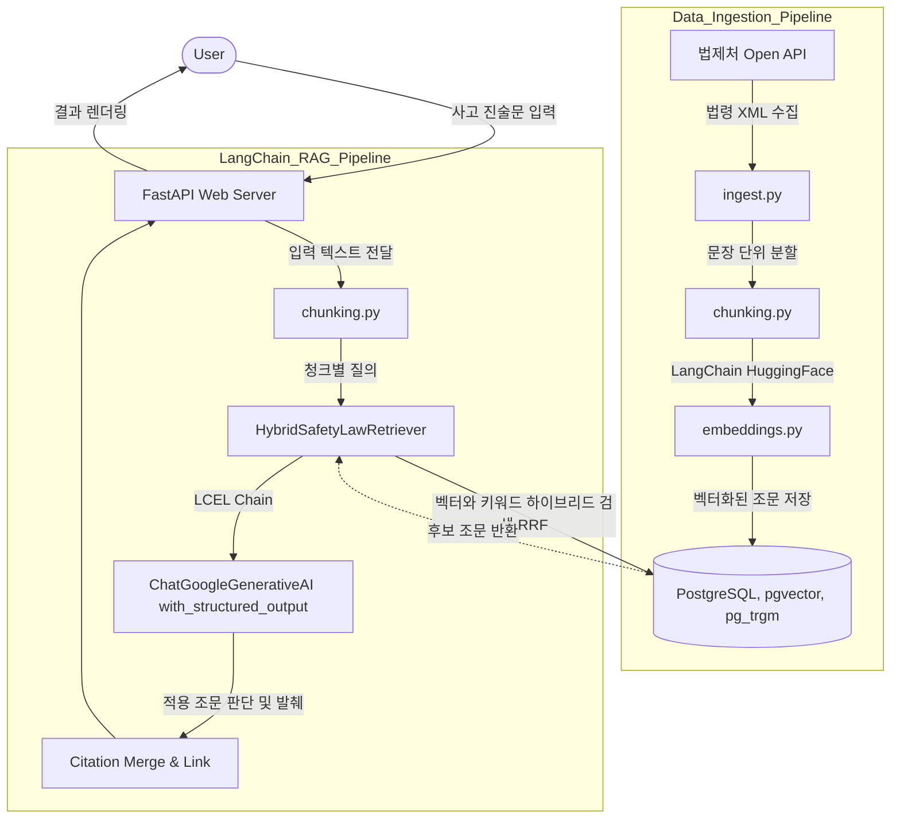

# SafetyLawAdvisor

사고 상황을 서술한 긴 텍스트를 입력하면, 산업안전보건 관련 법령 중 실제로 적용되는 조문을 찾아
원문 위치에 하이라이트하고 법제처 원문 링크를 함께 보여주는 서비스.

## 아키텍처



### 💡 초보자를 위한 아키텍처 상세 설명

이 프로젝트는 마치 도서관에서 책을 미리 분류해 두고, 나중에 질문을 받으면 가장 알맞은 책을 찾아주는 것처럼 **두 가지 주요 단계**로 나뉘어 동작합니다.

#### 1. 데이터 수집 및 저장 (Data Ingestion Pipeline)
우리가 검색할 "법률 책"들을 도서관(DB)에 미리 채워넣는 준비 과정입니다.
- **법제처 Open API (`ingest.py`)**: 국가에서 제공하는 산업안전보건법 원문 데이터를 인터넷을 통해 자동으로 가져옵니다.
- **문장 분할 (`chunking.py`)**: 가져온 긴 법령 글을 컴퓨터가 이해하고 검색하기 쉽도록 짧은 문장 단위로 쪼갭니다.
- **의미 벡터화 (`embeddings.py`)**: 쪼개진 텍스트들을 수학적인 숫자(벡터)로 변환합니다. 이렇게 하면 단순히 단어가 일치하는 것을 넘어 "의미가 비슷한" 문장을 찾을 수 있습니다. (추가 비용이 들지 않는 `multilingual-e5-large` 로컬 모델을 사용합니다.)
- **데이터베이스 (`PostgreSQL + pgvector`)**: 변환된 숫자와 원문 데이터를 전용 저장소에 차곡차곡 보관해 둡니다.

#### 2. AI 분석 및 검색 (LangChain RAG Pipeline)
사용자가 사고 내용을 입력했을 때, 저장된 법령 중 가장 정확한 조문을 찾아 매칭해주는 실제 서비스 과정입니다.
- **질의 텍스트 전달**: 사용자가 입력한 긴 사고 진술문을 여러 개의 짧은 문장으로 나눕니다.
- **하이브리드 검색 (`HybridSafetyLawRetriever`)**: 사용자의 문장들을 데이터베이스에 던져 검색합니다. 이때 단순히 **같은 단어(키워드)**가 있는지 찾는 방식과, **문맥의 의미(벡터)**가 비슷한지 찾는 두 가지 방식을 섞어서(하이브리드) 가장 관련성 높은 법 조문 후보들을 1차로 싹쓸이해옵니다.
- **AI 최종 판단 (`ChatGoogleGenerativeAI`)**: 찾아온 후보 법 조문들과 사용자의 사고 진술문을 최신 인공지능인 **Gemini API**에게 넘겨줍니다. *"이 사고 상황에 이 법 조문들이 실제로 적용되는 게 맞는지 확인해줘"*라고 지시(프롬프트)하여, AI가 엄격하게 진짜로 적용되는 조문만 선별하고 인용 근거를 작성합니다.
- **결과 화면 (FastAPI 웹 서버)**: 최종적으로 선별된 법 조문과 링크를 사용자가 보기 편하도록 화면의 원문 위치에 노란색으로 하이라이트(형광펜) 칠해서 보여줍니다.

## 준비물

1. Docker / Docker Compose
2. 법제처 Open API OC 키: https://open.law.go.kr 에서 회원가입 후 발급
3. Gemini API 키: https://aistudio.google.com/apikey

## 설정

```bash
cp .env.example .env
# .env에 LAW_OC_KEY, GEMINI_API_KEY 채워넣기
```

## 실행

```bash
docker compose up -d db
docker compose build api
```

### 1) 법령 데이터 수집 (최초 1회, OC 키 필요)

```bash
docker compose run --rm api python -m app.ingest
```

`Data/DATA_SOURCE_URL.md`에 정의된 4개 법령(산업안전보건법, 시행령, 시행규칙,
산업안전보건기준에 관한 규칙)을 조문 단위로 수집해 DB에 저장하고 임베딩까지 생성한다.
법령이 개정되면 같은 명령을 다시 실행하면 된다(법령ID+조번호 기준 upsert).

### 2) 웹 서버 실행

```bash
docker compose up api
```

http://localhost:8000 접속 후 사고 진술문을 입력하면 관련 조문이 하이라이트되어 표시된다.

## 테스트

```bash
pip install -r requirements.txt
pip install pytest
pytest
```

청킹 오프셋 계산과 법제처 링크 생성 로직에 대한 유닛 테스트가 포함되어 있다.
`ingest`/`annotate` 파이프라인은 실제 OC 키·Gemini 키가 있어야 end-to-end 검증이 가능하다.

## 알아둘 점

- 법제처 딥링크 URL 패턴(`app/law_links.py`)은 사이트 구조가 바뀌면 이 파일만 수정하면 된다.
- 조문 청킹/질의 텍스트 청킹은 모두 `app/chunking.py`의 문장 단위 슬라이딩 윈도우를 공유한다.
- 하이브리드 검색은 `app/retrieval.py`에서 벡터 유사도와 트라이그램 유사도를 RRF로 결합한다.
